<h1 align="center">Hi, I'm Roshini M Lakshmana 👋</h1>

<h3 align="center">
Security Engineer | Detection Engineering | Incident Response | Threat Intelligence | AI Security
</h3>

Security Engineer specializing in threat detection, incident response, threat intelligence, SIEM, SOAR, DFIR, cloud security, detection-as-code, security automation, and AI/LLM security.

---

🎯 **Open to Security Engineering, Detection Engineering, Incident Response, Threat Intelligence, DFIR, AI Security, and Security Automation opportunities.**

---

## 👩‍💻 About Me

I am a **Security Engineer and Cybersecurity Analyst** with over **2.3 years of experience at IBM**

My expertise includes **Detection Engineering, Incident Response, Threat Hunting, Cyber Threat Intelligence, SIEM, SOAR, Endpoint Security, Log Analysis, Digital Forensics, Cloud Security, Security Automation, and MITRE ATT&CK mapping**.

I am also building security solutions at the intersection of **Artificial Intelligence and Cybersecurity**, including **AI attack detection, LLM security guardrails, prompt injection detection, model supply-chain security, RAG security, MCP security, AI-BOM generation, and MITRE ATLAS mapping**.

🔐 Experienced with **Splunk, Microsoft Sentinel, IBM QRadar, Wazuh,IBMglass, Shuffle SOAR playbooks Sysmon, AWS, Azure, Python, FastAPI, LangFlow,Rag Pipeline, Hugging Face,MCP, Ollama, Autopsy, Sleuth Kit, Magnet AXIOM, Volatility, CyberChef and Docker**.

🎓 M.S. in Cybersecurity with a **4.0 GPA** in cybercrime Investigation  
📜 CompTIA Security+  & Ai in Cybersecurity Certified  
📍 San Francisco Bay Area , CA & Austin, TX | Open to relocation  

Cybersecurity Blog  — Medium (@Commoness): 60+ articles on detection engineering, SOC automation, threat intelligence, and AI in security projects. 

---

## 🌐 Connect With Me

-->
## 🛠️ Technical Skills

### Security Operations & Detection

### Threat Intelligence & Incident Response

### AI & LLM Security

### Programming, Cloud & DevSecOps

### Digital Forensics & Security Testing

## 🚀 Featured Cybersecurity & AI Security Projects

### 1. 🔐 MCP Vulnerability Detection Gateway

An AI security gateway designed to inspect and control communication between **LLM applications, AI agents, MCP clients, and MCP servers**.

The project focuses on detecting unsafe tool calls, malicious prompts, unauthorized actions, sensitive-data exposure, and security risks before requests reach connected MCP tools.

**Key Areas:** MCP Security, AI Agent Security, Prompt Injection Detection, Tool-Call Validation, Access Control, LLM Security

**Tech Stack:** Python, FastAPI, MCP, LangFlow, LLM Guardrails, MITRE ATLAS, OWASP LLM Top 10

🔗 **Repository:** [View MCP Vulnerability Detection](https://github.com/RoshiniMlakshmana/MCP-vulnerability-detection)

2. 🛡️ AI Attack Detection Classifier — Confidence-Gated Guardrail

A real-time AI security guardrail that analyzes incoming prompts and outgoing model responses, classifying activity as **Allow, Flag, or Block** based on confidence scores.

Detects prompt injection, jailbreaks, system-prompt theft, API-key fishing, encoded attacks, multilingual attacks, multi-turn attacks, PII leakage, and sensitive-data exposure.

🔗 **Repository:** [View AI Attack Detection Classifier](https://github.com/RoshiniMlakshmana/ai-prompt-attack-detector-and-classifier)

3. 📊Sysmon Log Parser with Threat Intelligence Enrichment

A detection-engineering project that parses Windows Sysmon logs, extracts security-relevant indicators, and enriches them with threat-intelligence sources.

The parser helps identify suspicious processes, command-line activity, network connections, file changes, hashes, domains, and IP addresses. Detected activity can be mapped to **MITRE ATT&CK techniques** and do the automated timeline based on the highest supicious actiivty for investigation and threat hunting.

**Key Areas:** Log Analysis, Windows Security, Sysmon, IOC Enrichment, Threat Hunting, Detection Engineering

**Tech Stack:** Python, Sysmon, VirusTotal, URLScan, ThreatFox, MITRE ATT&CK, JSON, Windows Event Logs

🔗 **Repository:** [View Sysmon Security Parser](https://github.com/RoshiniMlakshmana/sysmon-security-parser-and-log-analysis)

---

---

## 📊 GitHub Activity

  
  

